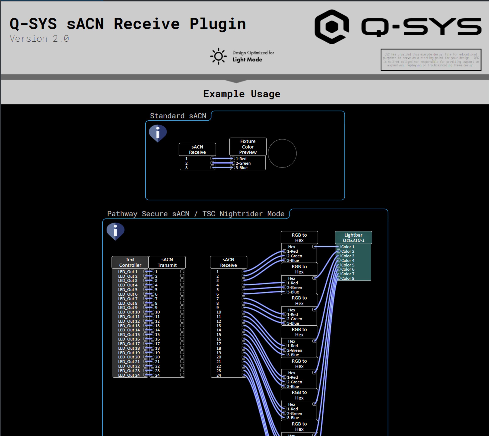

# Q-SYS sACN Receive

Q-SYS sACN Receive allows reception of streaming ACN (sACN, also known as e.131) lighting data directly within a design. This plugin also supports reception of Pathway Secure sACN encrypted data.

## Version History

- **Version 1.0**
  - Initial release of the receive plugin

## Tested Environment

- **Q-SYS Designer:** 10.2.1
- **DMX Gateway:** [Pathway Pathport Gateway](https://pathway.acuitybrands.com/products/dmx-rdm-ethernet-gateways)

# Example File

Included with the repository is an example file that walks through multiple use cases of the plugin.

## Controls

- **Interface**
  - A combo box to select the network interface to receive data from
- **Unicast**
  - A toggle button to switch between unicast and multicast reception
- **IPAddress**
  - A text field to specify the source IP address
- **Universe**
  - An integer to define the universe ID. Valid range is between 1 and 63999
- **Priority**
  - An integer to display the priority of the received data. Valid range is between 0 and 200
- **Password (Pathway Secure sACN Mode Only)**
  - A string to define the password set in the Pathway Security domain
- **Receive**
  - A boolean control to enable or disable reception of data from the plugin
  - When enabled, the button is labeled "Receiving"
  - When disabled, the button is labeled "Stopped"
- **Status**
  - A status indicator showing the status of the plugin
- **Source**
  - Displays the source name of the active receiver
- **Source IP**
  - Displays the source IP address of the active receiver
- **Source CID**
  - Displays the source CID of the active receiver
- **Slot Count**
  - Displays the number of received slots
- **Rx Rate**
  - Displays the receive rate

## Properties

- **Number of Channels**
  - An integer to define the number of channels received
  - The plugin will always start at channel 1 (per the sACN specifications)
  - Range is 2-512
  - Default is 10
- **Protocol**
  - Selectable between sACN and Pathway Secure sACN
  - Default is sACN
- **Debug Print**
  - Selectable between None, Rx, Function Calls, and All
  - Default is None

## Control Pins

|Pin Name|Value|String|Position|Pins Available|
|--------|--------|--------|--------|--------|
|DMX Out [x]|0-255|0-255|0-1|Output (Locked)|
|Interface|-|LAN A, LAN B, Aux A, Aux B, PC NIC Name|-|Both|
|IP Address|-|IP Address|-|Both|
|Priority|0-200|0-200|0-1|Output|
|Password|-|Security Domain password|-|None|
|Status|0-5|OK (Green), Compromised (Orange), Fault (Red), Not Present (Gray), Missing (Red), Initializing (Blue)|-|Output|
|Receive|0, 1|false, true|0, 1|Both|
|Unicast|0, 1|false, true|0,1|Both|
|Universe|1-63999|-|-|Both|
